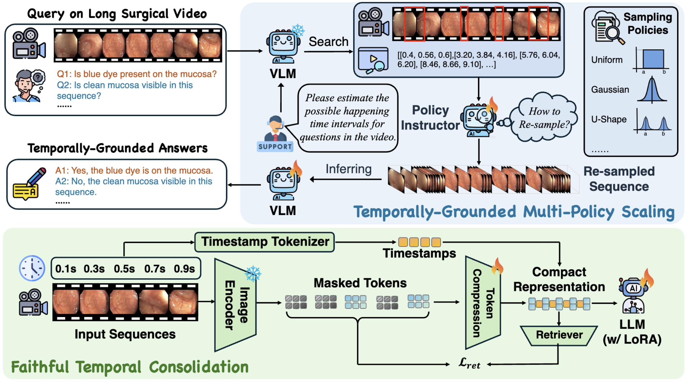

# [MICCAI26‘] SurgLQA: Scalable Long-Horizon Surgical Video Question Answering
## Demo
[![Watch the video]](https://youtu.be/JjkSskG5OFg)

## Abstract

> Surgical Video Question Answering (VideoQA) provides a promising paradigm for dynamic intraoperative interpretation, enabling real-time decision support and context-aware retrieval in clinical environments. Nevertheless, existing approaches are predominantly restricted to images or short clips, limiting their ability to model long-range procedural dynamics and causal dependencies across extended surgical workflows. To address this challenge, we propose SurgLQA, a unified long-horizon VideoQA framework for scalable surgical reasoning. This framework incorporates Faithful Temporal Consolidation (FTC), which leverages intrinsic temporal cues to construct compact long-range representations while preserving fine-grained temporal fidelity. Further, we develop Temporally-Grounded Multi-Policy Scaling (TMS), an adaptive test-time inference paradigm that strategically adjusts policy-level reasoning capacity within temporally grounded contexts. To facilitate systematic evaluation, we restructured a long-duration colonoscopy VideoQA benchmark, Colon-LQA, and conducted extensive experiments on Colon-LQA and REAL-Colon-VQA. Experimental results demonstrate that our approach achieves consistent performance gains in long-range reasoning with temporally grounded inference.

## 🔥🔥🔥 News!!
* May 8, 2026: 🤗 Our work has been early accepted by MICCAI 2026! Congratulations!

## Colon-LQA Dataset and SurgLQA
Coming soon!
