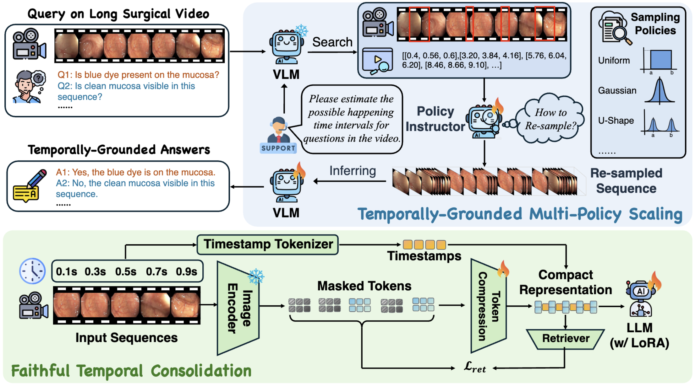

# [MICCAI 2026] SurgLQA: Scalable Long-Horizon Surgical Video Question Answering

## Demo

https://github.com/user-attachments/assets/fef04460-cab6-4d87-8ac1-b246620fc05f

[](https://opensource.org/licenses/MIT)

## Abstract

> Surgical Video Question Answering (VideoQA) provides a promising paradigm for dynamic intraoperative interpretation, enabling real-time decision support and context-aware retrieval in clinical environments. Nevertheless, existing approaches are predominantly restricted to images or short clips, limiting their ability to model long-range procedural dynamics and causal dependencies across extended surgical workflows. To address this challenge, we propose SurgLQA, a unified long-horizon VideoQA framework for scalable surgical reasoning. This framework incorporates Faithful Temporal Consolidation (FTC), which leverages intrinsic temporal cues to construct compact long-range representations while preserving fine-grained temporal fidelity. Further, we develop Temporally-Grounded Multi-Policy Scaling (TMS), an adaptive test-time inference paradigm that strategically adjusts policy-level reasoning capacity within temporally grounded contexts. To facilitate systematic evaluation, we restructured a long-duration colonoscopy VideoQA benchmark, Colon-LQA, and conducted extensive experiments on Colon-LQA and REAL-Colon-VQA. Experimental results demonstrate that our approach achieves consistent performance gains in long-range reasoning with temporally grounded inference.
<div align=center>

</div>


## 🔥🔥🔥 News!!

* September 29, 2026: Qwen3-VL 2B fine-tuning code is available.
* May 8, 2026: 🤗 Our work has been early accepted by MICCAI 2026! Congratulations!

## Released code

The first release contains the Qwen3-VL 2B supervised fine-tuning recipe used
for the project:

- [Qwen3-VL 2B fine-tuning](finetuning/qwen3_vl_2b): LoRA training with
  DeepSpeed, SurgLQA dataset registration, validation utilities, and a
  reproducible launcher.

The training data and model checkpoints are intentionally not committed to
this repository.

## Release roadmap

- [x] Qwen3-VL 2B fine-tuning code
- [ ] Remaining SurgLQA method and inference code
- [ ] Evaluation code and benchmark scripts
- [ ] Colon-LQA dataset and annotations
- [ ] REAL-Colon-VQA preprocessing instructions
- [ ] Model checkpoints

## Quick start

```bash
cd finetuning/qwen3_vl_2b
pip install -r requirements.txt
pip install flash-attn==2.7.4.post1 --no-build-isolation

export SURGLQA_ANNOTATION=/path/to/surglqa_train.json
export SURGLQA_MEDIA_ROOT=/path/to/surglqa_media
bash scripts/train_lora.sh
```

See the [fine-tuning documentation](finetuning/qwen3_vl_2b/README.md) for the
annotation format, configuration options, and attribution.
